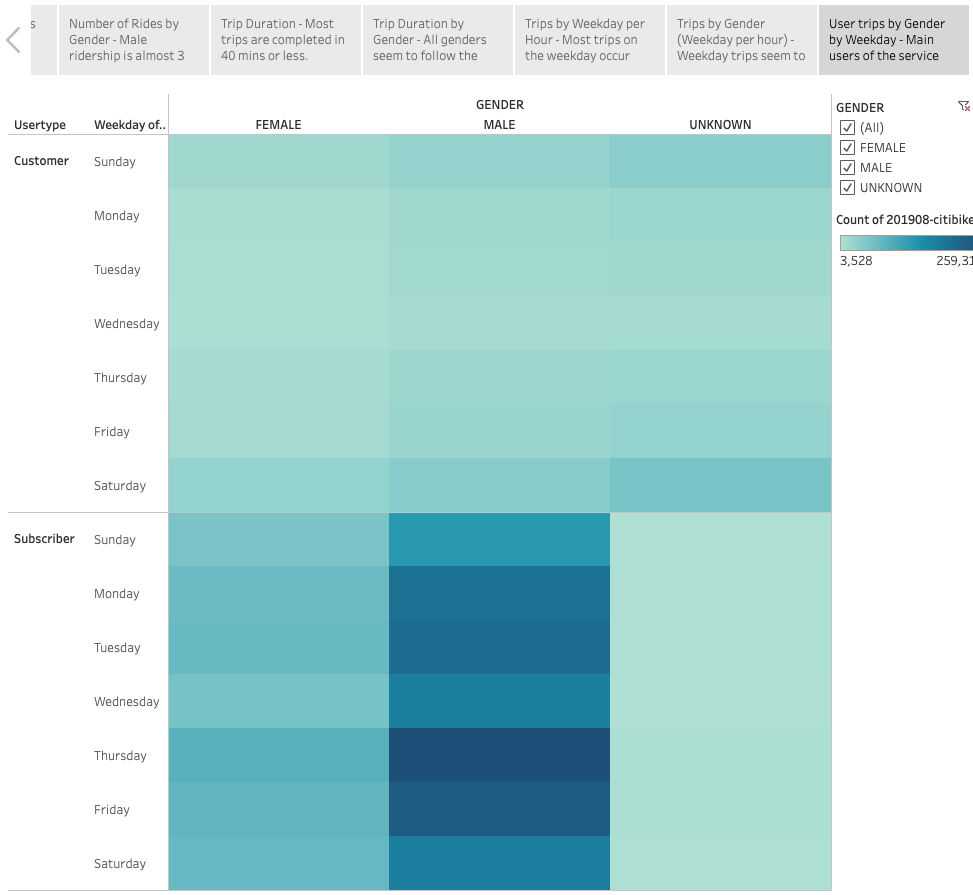

# bikesharing

## Purpose
To show that creating a bike-sharing program in Des Moines is a solid business proposal by analysing NYC Citibike data during the month of August 2019. This will be demonstrated via the 7 visualizations below.

## Results

Story:
[Tableau Story](https://public.tableau.com/app/profile/christopher.law5292/viz/Mod14Challenge_16273568304540/CitiBike?publish=yes)

### Visualization 1: Number of Rides

There were 2,344,224 trips taken in August.
  
  
### Visualization 2: Number of Rides by Gender

These are the number of Rides by Gender. There were about 3 times more male riders then female riders.
  
  
### Visualization 3: Trip Duration

Most trips are completed in 40 mins or less.
  
  
### Visualization 4: Trip Duration by Gender

All genders seem to follow the trend and finish their trips in 40 mins or less.
  
  
### Visualization 5: Trip Duration by Weekday per Hour

Most trips during the work week happen just before 9am and after 5pm. On the weekend, we see that the bike usage is stable from 9am to 10pm.
  

### Visualization 6: Trip by Gender (Weekday per hour)

All genders seem to follow the above trend.
  
  
### Visualization 7: User trips by Gender by Weekday

The heaviest users of the service seem to be Male subscribers, followed by Female subscribers.
  

## Summary
Over the month of August 2019, 2,344,224 trips were taken. From the heat maps above, we see that the main users during the work week seem to be commuters going to and from their workplaces. On the weekend, the usage of the bikes seemed to be steady.

Des Moines has an unemployment rate of 4.6% as of June 2021[1], comparied to to NYC's unemployment rate of 10.6%[2]. When we take into account that most of the bikes in NYC seem to be used for the daily commute, then the employment rate in Des Moines makes it favourable to start a bike-sharing program in Des Moines.

### Additional Visualizations

An additional visualization would be to show statistics (min, max, avg) for total distance travelled for each trip. This would be done by creating a new calculated field to determine the distance based on the start location and end location.

Another visualization that could explored would be trip distance based on start time using a heatmap. A calculated field for trip distance would need to be created, and this visualization could be used to demonstrate whether weekend or weekday trips have higher distances travelled.

## References
<a id="1">[1]</a> 
Economy at a Glance
https://www.bls.gov/eag/eag.ia_desmoines_msa.htm#eag_ia_desmoines_msa.f.1 
<a id="2">[2]</a>
Developments in the New York City Labor Market
https://dol.ny.gov/labor-statistics-new-york-city-region

